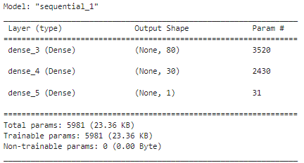
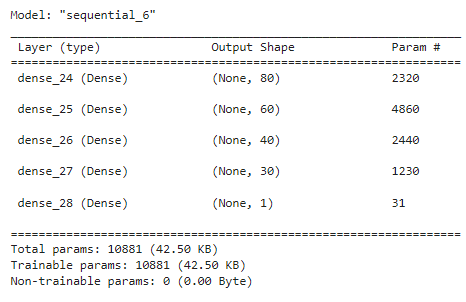
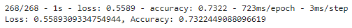

# Written Report for deep-learning-challenge
### Overview

The purpose of this analysis was to train a Neural Network Model to correctly predict whether an applicant will be successful if funded by Alphabet Soup.

### Results

#### Data Processing

- The target variable was the IS_SUCCESSFUL column, a boolean saying whether or not the client was successful.
- The features of the model are the folling columns:
    - APPLICATION_TYPE - Alphabet Soup application type
    - AFFILIATION - Affiliated sector of industry
    - CLASSIFICATION - Government organization classification
    - USE_CASE - Use case for funding
    - ORGANIZATION - Organization type
    - STATUS - Active status
    - INCOME_AMT - Income classification
    - SPECIAL_CONSIDERATIONS - Special considerations for application
    - ASK_AMT - Funding amount requested
- The variables required to be removed are the identification columns EIN and NAME

#### Compiling, Training, and Evaluating the Model

- A Neural Network model with two hidden layers, with 80 and 30 neurons, was initially run. The summary is as follows:

Eventually more hidden layers were added with the following as the final Neural Network shape:

More layers were added because there were so many inputs used for the model and the accuracy seemed to reach it's limit at just above 70%. The ReLu, tanh, and sigmoid activation functions were attempted for the hidden layers, with the best results coming from the sigmoid activation function.

- I was not able to achieve the target model performance of 75%, the highest accuracy score reached was 73.5%:

- Other than adjusting the activation functions and number of hidden layers/neurons, models were ran without some of the features. First a model was run without the feature CLASSIFICATION, which did not significantly impact the accuracy of the model. The model was then run without the feature APPLICATION_TYPE and the accuracy decreased by a few percentage points.

### Summary

The model appears to run best with multiple hidden layers and starting with about 80 neurons in the first layer. It is recommended that further analysis start with the model shape shown in the Results section and adding hidden layers or neurons. Dropping the features CLASSIFICATION and APPLICATION_TYPE did not improve the model's accuracy, however adjusting how the OTHER bins are created may also help. Running the model without other features, such as SPECIAL_CONSIDERATIONS, may also improve the accuracy. Sigmoid activation functions for each of the hidden layers produced the best results, however tanh produced a very similar accuracy score.